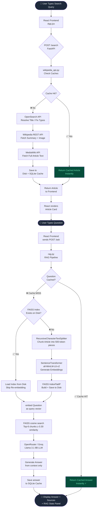
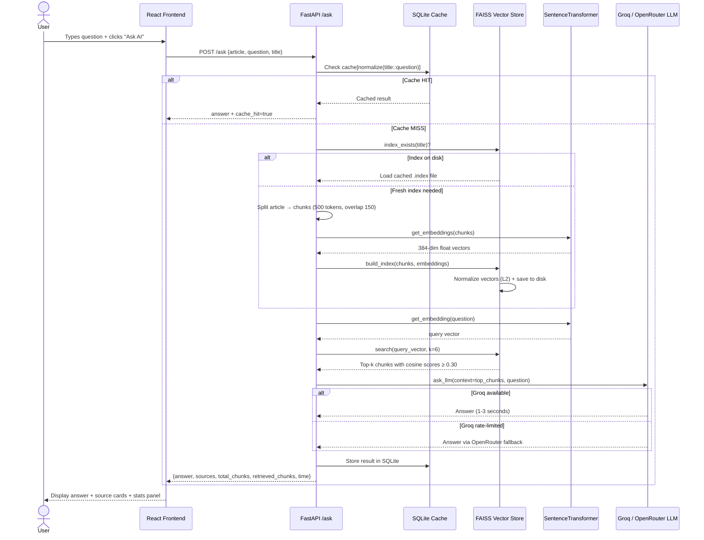

<div align="center">

# 🧠 AI Wikipedia Search using RAG

### Ask questions about any topic — powered by Retrieval-Augmented Generation

[](https://python.org)
[](https://fastapi.tiangolo.com)
[](https://react.dev)
[](https://vitejs.dev)
[](https://github.com/facebookresearch/faiss)
[](LICENSE)

> A full-stack AI application that lets users search any Wikipedia topic and then ask natural language questions about it using a production-grade RAG (Retrieval-Augmented Generation) pipeline.

[**Live Demo**](#) · [**Architecture**](docs/architecture.md) · [**Setup Guide**](docs/setup.md) · [**API Docs**](docs/api.md)

</div>

---

## 📖 Table of Contents

- [Project Overview](#-project-overview)
- [Features](#-features)
- [Architecture](#-architecture)
- [Flow Diagram](#-flow-diagram)
- [Tech Stack](#-tech-stack)
- [Folder Structure](#-folder-structure)
- [Quick Start](#-quick-start)
- [API Reference](#-api-reference)
- [RAG Pipeline Explained](#-rag-pipeline-explained)
- [Performance & Caching](#-performance--caching)
- [Future Improvements](#-future-improvements)
- [Author](#-author)
- [License](#-license)
- [Acknowledgements](#-acknowledgements)

---

## 🌟 Project Overview

**AI Wikipedia RAG** is a full-stack application that bridges Wikipedia's knowledge base with the power of modern AI. Instead of asking an LLM to answer from memory (which risks hallucinations), this system:

1. **Fetches** the real Wikipedia article for any topic you search
2. **Splits** the article into overlapping text chunks
3. **Embeds** each chunk into a high-dimensional vector using `all-MiniLM-L6-v2`
4. **Indexes** those vectors in a FAISS database for lightning-fast similarity search
5. **Retrieves** only the most relevant chunks for your question
6. **Sends** those chunks as context to an LLM (Llama 3.1 via Groq / OpenRouter)
7. **Returns** a grounded, accurate, citation-backed answer

This approach is called **Retrieval-Augmented Generation (RAG)** and is the industry standard for building factual, reliable AI Q&A systems.

---

## ✨ Features

| Feature | Description |
|---|---|
| 🔍 **Wikipedia Search** | Fetches title, summary, image, and full article text from Wikipedia's REST API |
| 🤖 **Ask AI** | Natural language questions answered using the RAG pipeline |
| 🧩 **Smart Chunking** | Article split into overlapping 500-token chunks using `RecursiveCharacterTextSplitter` |
| 📐 **Vector Embeddings** | `all-MiniLM-L6-v2` model converts text to 384-dimensional semantic vectors |
| ⚡ **FAISS Search** | Cosine similarity search over all chunks in milliseconds |
| 🗃️ **3-Level Cache** | In-memory → SQLite → disk article cache for zero-latency repeat queries |
| 💾 **Persistent FAISS Index** | Article embeddings saved to disk; reloaded on repeat questions without re-embedding |
| 📚 **Search History** | Searches stored in `localStorage` with one-click replay |
| 🔤 **Typo Correction** | OpenSearch API auto-corrects misspelled queries (`"virat kholi"` → `"Virat Kohli"`) |
| 📊 **RAG Stats Panel** | Live display of chunks created, chunks retrieved, cache status, and response time |
| 🎨 **Modern Dark UI** | Glassmorphism, gradient animations, Inter font, fully responsive |
| 🔀 **LLM Fallback** | Groq (primary, fast) → OpenRouter (fallback) — never a dead end |

---

## 🏗️ Architecture

The application is split into two independent services that communicate over HTTP:

```
┌─────────────────────────────────────────────────────────────────┐
│                        USER'S BROWSER                           │
│                                                                 │
│   ┌──────────────────────────────────────────────────────────┐  │
│   │              React + Vite Frontend                       │  │
│   │   Search Bar │ Article Card │ Ask AI │ Source Cards      │  │
│   └────────────────────────┬─────────────────────────────────┘  │
│                            │ HTTP (localhost:5173)               │
└────────────────────────────┼────────────────────────────────────┘
                             │
                    ┌────────▼────────┐
                    │  FastAPI Server │  ← localhost:8001
                    │   (Python 3.10) │
                    └────────┬────────┘
                             │
          ┌──────────────────┼──────────────────┐
          │                  │                  │
   ┌──────▼──────┐   ┌───────▼──────┐   ┌──────▼──────┐
   │  Wikipedia  │   │  RAG Engine  │   │  LLM Layer  │
   │  REST API   │   │  + FAISS DB  │   │ Groq/Router │
   └─────────────┘   └─────────────┘   └─────────────┘
```

For the complete architecture diagram and detailed explanation, see [**docs/architecture.md**](docs/architecture.md).

---

## 🔄 Flow Diagram

### End-to-End Request Flow



### Sequence Diagram — Ask AI Flow



---

## 🛠️ Tech Stack

### Backend

| Technology | Version | Purpose |
|---|---|---|
| **Python** | 3.10+ | Core language |
| **FastAPI** | 0.138 | REST API framework, async-ready |
| **Uvicorn** | 0.49 | ASGI server |
| **Pydantic** | 2.x | Request/response validation |
| **sentence-transformers** | 5.6 | `all-MiniLM-L6-v2` embedding model |
| **FAISS-CPU** | 1.14 | High-performance vector similarity search |
| **LangChain Text Splitters** | latest | `RecursiveCharacterTextSplitter` |
| **SQLite (built-in)** | — | Persistent cache for answers + queries |
| **requests** | 2.34 | Wikipedia API HTTP calls |
| **openai SDK** | latest | Compatible client for Groq + OpenRouter |
| **python-dotenv** | — | Environment variable management |

### Frontend

| Technology | Version | Purpose |
|---|---|---|
| **React** | 19.x | UI component library |
| **Vite** | 8.x | Build tool + dev server |
| **Vanilla CSS** | — | Custom styles, glassmorphism, animations |
| **Inter (Google Fonts)** | — | Typography |
| **localStorage** | Web API | Search history persistence |

### External APIs

| API | Purpose |
|---|---|
| **Wikipedia OpenSearch API** | Typo correction and title resolution |
| **Wikipedia REST API v1** | Article summary, thumbnail, URL |
| **Wikipedia MediaWiki API** | Full plain-text article extraction |
| **Groq API** | Primary LLM — Llama 3.1 8B Instant (fast, free) |
| **OpenRouter API** | Fallback LLM — free tier routing |

---

## 📁 Folder Structure

```
ai-wikipedia-rag/
│
├── 📄 README.md                    ← You are here
├── 📄 requirements.txt             ← Root-level dependencies snapshot
├── 📄 .gitignore
│
├── 🗂️ backend/
│   ├── 📄 requirements.txt         ← Backend Python dependencies
│   ├── 📄 .env                     ← API keys (GROQ_API_KEY, OPENROUTER_API_KEY)
│   ├── 📄 .gitignore
│   │
│   ├── 🗂️ app/                     ← Core application package
│   │   ├── 📄 _init_.py
│   │   ├── 📄 main.py              ← FastAPI app, CORS, endpoints
│   │   ├── 📄 wikipedia_api.py     ← Wikipedia fetch + 3-level caching
│   │   ├── 📄 rag.py               ← RAG orchestration pipeline
│   │   ├── 📄 vector_store.py      ← FAISS index build/search/persist
│   │   ├── 📄 embeddings.py        ← SentenceTransformer wrapper
│   │   ├── 📄 llm.py               ← Groq + OpenRouter LLM interface
│   │   ├── 📄 cache.py             ← SQLite-backed persistent cache
│   │   ├── 📄 article_store.py     ← JSON article persistence layer
│   │   └── 📄 utils.py             ← Cache key normalizer
│   │
│   └── 🗂️ data/                    ← Auto-created at runtime
│       ├── 📄 cache.db             ← SQLite cache database
│       ├── 🗂️ articles/            ← Cached Wikipedia articles (JSON)
│       └── 🗂️ faiss/               ← Persisted FAISS indexes + chunk files
│
├── 🗂️ frontend/
│   ├── 📄 package.json
│   ├── 📄 vite.config.js
│   ├── 📄 index.html
│   │
│   └── 🗂️ src/
│       ├── 📄 main.jsx             ← React entry point
│       ├── 📄 App.jsx              ← Main app component (all logic + UI)
│       ├── 📄 App.css              ← All styling (930 lines of premium CSS)
│       └── 📄 index.css            ← Global reset
│
└── 🗂️ docs/                        ← Full documentation
    ├── 📄 architecture.md
    ├── 📄 backend.md
    ├── 📄 frontend.md
    ├── 📄 rag_pipeline.md
    ├── 📄 api.md
    ├── 📄 setup.md
    ├── 📄 project_structure.md
    └── 📄 future_scope.md
```

---

## 🚀 Quick Start

### Prerequisites

- Python 3.10 or higher
- Node.js 18 or higher
- A free [Groq API key](https://console.groq.com) *(recommended)* or [OpenRouter API key](https://openrouter.ai)

### 1. Clone the Repository

```bash
git clone https://github.com/yourusername/ai-wikipedia-rag.git
cd ai-wikipedia-rag
```

### 2. Set Up the Backend

```bash
cd backend

# Create and activate virtual environment
python -m venv .venv

# Windows
.venv\Scripts\activate

# macOS / Linux
source .venv/bin/activate

# Install dependencies
pip install -r requirements.txt
```

### 3. Configure API Keys

Edit `backend/.env`:

```env
OPENROUTER_API_KEY=your_openrouter_key_here
GROQ_API_KEY=your_groq_key_here   # Recommended for speed
```

### 4. Start the Backend Server

```bash
# From the project root (ai-wikipedia-rag/)
uvicorn backend.app.main:app --reload --port 8001
```

You should see:
```
INFO:     Uvicorn running on http://127.0.0.1:8001
```

### 5. Set Up and Start the Frontend

In a **new terminal**:

```bash
cd frontend
npm install
npm run dev
```

Open [http://localhost:5173](http://localhost:5173) in your browser. 🎉

---

## 📡 API Reference

### `GET /`

Health check endpoint.

**Response:**
```json
{
  "message": "AI Wikipedia RAG Backend is running!",
  "version": "2.0.0"
}
```

---

### `POST /search`

Search for a Wikipedia article by topic.

**Request Body:**
```json
{
  "query": "Virat Kohli"
}
```

**Response:**
```json
{
  "title": "Virat Kohli",
  "summary": "Virat Kohli is an Indian cricketer...",
  "full_content": "Virat Kohli (born 5 November 1988)...",
  "url": "https://en.wikipedia.org/wiki/Virat_Kohli",
  "image": "https://upload.wikimedia.org/...",
  "corrected_query": "Virat Kohli",
  "original_query": "virat kholi"
}
```

---

### `POST /ask`

Ask an AI question about a Wikipedia article using the RAG pipeline.

**Request Body:**
```json
{
  "article": "<full article text>",
  "question": "When was Virat Kohli born?",
  "title": "Virat Kohli"
}
```

**Response:**
```json
{
  "answer": "Virat Kohli was born on 5 November 1988.",
  "sources": [
    {
      "text": "Virat Kohli (born 5 November 1988) is an Indian international cricketer...",
      "score": 0.8734
    }
  ],
  "total_chunks": 42,
  "retrieved_chunks": 4,
  "cache_hit": false,
  "time": "2.34 s"
}
```

Full API documentation with error cases: [**docs/api.md**](docs/api.md)

---

## 🔬 RAG Pipeline Explained

RAG solves a fundamental problem with LLMs: **they hallucinate**. When you ask an LLM "Who is XYZ?" without grounding, it may confidently fabricate facts.

Our RAG pipeline solves this by:

```
Article Text
    ↓
Chunking (500 tokens, 100 overlap)
    ↓
Embeddings (384-dim vectors via all-MiniLM-L6-v2)
    ↓
FAISS Index (cosine similarity, IndexFlatIP)
    ↓
Query Embedding → Similarity Search → Top-6 Chunks
    ↓
LLM receives ONLY the retrieved chunks as context
    ↓
Answer grounded in real Wikipedia text
```

**Why each component matters:**

| Component | Why It's Here |
|---|---|
| **Chunking** | LLMs have token limits; chunking ensures we can fit relevant context |
| **Overlap** | Prevents answers from being cut off at chunk boundaries |
| **Embeddings** | Converts text to numbers that capture semantic meaning |
| **FAISS** | Searches millions of vectors in milliseconds using ANN |
| **Top-k Retrieval** | Only the most relevant passages reach the LLM |
| **Cosine Similarity** | Measures semantic closeness, not just keyword overlap |

For the complete beginner-friendly explanation, see [**docs/rag_pipeline.md**](docs/rag_pipeline.md).

---

## ⚡ Performance & Caching

This system implements **3 independent caching layers**:

```
Request arrives
    │
    ▼
Level 1: In-Memory dict (Python process, ~0ms)
    │ miss
    ▼
Level 1.5: SQLite database (disk, ~1ms)
    │ miss
    ▼
Level 2: Article JSON on disk (~2ms file read)
    │ miss
    ▼
Level 3: Full network fetch (Wikipedia API, ~300-800ms)
```

**FAISS Index Cache**: Once an article is embedded, the `.index` file and `.chunks.json` are saved to `backend/data/faiss/`. Subsequent questions about the same article skip embedding entirely.

**Answer Cache**: Every question-answer pair is stored in SQLite. Repeated identical questions return in `<5ms` regardless of article length.

---

## 🔮 Future Improvements

- [ ] **Multi-article RAG** — Answer questions that span multiple Wikipedia articles
- [ ] **Streaming responses** — Stream LLM tokens to the frontend as they arrive
- [ ] **User authentication** — Save personalized history and preferences
- [ ] **PDF / URL ingestion** — RAG over custom documents, not just Wikipedia
- [ ] **Conversational memory** — Follow-up questions remember previous context
- [ ] **Reranking** — Cross-encoder reranker for better top-k precision
- [ ] **Quantized embeddings** — Use FAISS IVFPQ for scalability to millions of articles
- [ ] **Multiple languages** — Wikipedia has articles in 300+ languages
- [ ] **Citation highlighting** — Highlight the exact sentence in the article that answered the question
- [ ] **Docker Compose** — One-command deployment

See the full roadmap in [**docs/future_scope.md**](docs/future_scope.md).

---

## 👤 Author

**Sarthak Makkar**

- GitHub: [@sarthak102005](https://github.com/sarthak102005)
- Email: sarthakmakkar60@gmail.com

---

## 📜 License

This project is licensed under the **MIT License** — see the [LICENSE](LICENSE) file for details.

---

## 🙏 Acknowledgements

- [**Wikipedia**](https://www.wikipedia.org/) — For their open REST API
- [**Sentence Transformers**](https://www.sbert.net/) — For the `all-MiniLM-L6-v2` model
- [**Facebook AI Research**](https://github.com/facebookresearch/faiss) — For FAISS
- [**LangChain**](https://langchain.com) — For `RecursiveCharacterTextSplitter`
- [**Groq**](https://console.groq.com) — For ultra-fast LLM inference via LPU hardware
- [**OpenRouter**](https://openrouter.ai) — For the fallback LLM routing layer
- [**FastAPI**](https://fastapi.tiangolo.com/) — For the elegant Python API framework
- [**Meta AI**](https://ai.meta.com/llama/) — For the Llama 3.1 model family

---

<div align="center">

Made with ❤️ and a lot of vector math by **Sarthak Makkar**

⭐ Star this repo if you found it useful!

</div>
