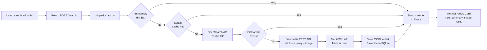

# 🏗️ System Architecture

This document explains the complete architectural design of the AI Wikipedia RAG system — how its components are organized, how data flows between them, and why each design decision was made.

---

## Table of Contents

- [High-Level Architecture](#high-level-architecture)
- [Component Overview](#component-overview)
- [Data Flow Walkthrough](#data-flow-walkthrough)
- [Layered Architecture Diagram](#layered-architecture-diagram)
- [Caching Architecture](#caching-architecture)
- [LLM Provider Architecture](#llm-provider-architecture)
- [Database Design](#database-design)
- [Design Decisions](#design-decisions)

---

## High-Level Architecture

The system is divided into two independent services that communicate via HTTP REST:

```
┌──────────────────────────────────────────────────────────────────────┐
│                          CLIENT LAYER                                │
│                                                                      │
│   Browser  →  React (Vite) App  →  localhost:5173                    │
│                   │                                                  │
│                   │  HTTP POST requests (JSON)                       │
└───────────────────┼──────────────────────────────────────────────────┘
                    │
┌───────────────────▼──────────────────────────────────────────────────┐
│                          SERVER LAYER                                │
│                                                                      │
│   FastAPI (Uvicorn ASGI)  →  localhost:8001                          │
│                                                                      │
│   ┌─────────────┐   ┌──────────────────────────────────────────────┐ │
│   │  /search    │   │  /ask                                        │ │
│   │             │   │                                              │ │
│   │ wikipedia   │   │  rag.py → vector_store.py → embeddings.py   │ │
│   │ _api.py     │   │       → llm.py                              │ │
│   └─────────────┘   └──────────────────────────────────────────────┘ │
│                                                                      │
└──────────────────────────────────────────────────────────────────────┘
                    │
┌───────────────────▼──────────────────────────────────────────────────┐
│                          STORAGE LAYER                               │
│                                                                      │
│   backend/data/                                                      │
│   ├── cache.db           ← SQLite: query→title maps + Q&A answers    │
│   ├── articles/          ← JSON files: full Wikipedia articles        │
│   └── faiss/             ← .index + .chunks.json per article         │
│                                                                      │
└──────────────────────────────────────────────────────────────────────┘
                    │
┌───────────────────▼──────────────────────────────────────────────────┐
│                       EXTERNAL SERVICES                              │
│                                                                      │
│   Wikipedia OpenSearch API   →  title resolution                     │
│   Wikipedia REST API v1      →  summary, image, URL                  │
│   Wikipedia MediaWiki API    →  full plain-text article              │
│   Groq API (primary)         →  Llama 3.1 8B LLM inference           │
│   OpenRouter API (fallback)  →  alternative LLM routing              │
│                                                                      │
└──────────────────────────────────────────────────────────────────────┘
```

---

## Component Overview

| Component | File(s) | Role |
|---|---|---|
| **API Gateway** | `main.py` | Receives requests, routes them, configures CORS |
| **Wikipedia Layer** | `wikipedia_api.py` | Fetches articles with 3-level caching |
| **Article Store** | `article_store.py` | Saves/loads full article JSON from disk |
| **RAG Orchestrator** | `rag.py` | Coordinates chunking → embedding → retrieval → LLM |
| **Text Splitter** | (LangChain, inside `rag.py`) | Splits articles into overlapping chunks |
| **Embedding Model** | `embeddings.py` | Encodes text into 384-dim vectors |
| **Vector Database** | `vector_store.py` | FAISS index: build, save, load, search |
| **LLM Interface** | `llm.py` | Calls Groq (fast) or OpenRouter (fallback) |
| **Cache** | `cache.py` | SQLite-backed persistent key-value store |
| **Utilities** | `utils.py` | Cache key normalization |
| **Frontend** | `App.jsx` + `App.css` | React UI: search, display, ask AI, stats |

---

## Data Flow Walkthrough

### Flow 1: User Searches a Topic



### Flow 2: User Asks a Question


---

## Layered Architecture Diagram

```
┌─────────────────────────────────────────┐
│            PRESENTATION LAYER           │
│                                         │
│  React components (App.jsx)             │
│  ├── Search bar + history               │
│  ├── Article card (image, summary, URL) │
│  ├── Ask AI section                     │
│  ├── Stats panel (chunks, time, cache)  │
│  └── Source cards (text + similarity %) │
├─────────────────────────────────────────┤
│             API LAYER                   │
│                                         │
│  FastAPI (main.py)                      │
│  ├── GET  /         → health check      │
│  ├── POST /search   → wikipedia_api.py  │
│  └── POST /ask      → rag.py            │
├─────────────────────────────────────────┤
│           BUSINESS LOGIC LAYER          │
│                                         │
│  wikipedia_api.py                       │
│  ├── Title resolution (OpenSearch)      │
│  ├── Summary fetch (REST API v1)        │
│  └── Full text fetch (MediaWiki)        │
│                                         │
│  rag.py                                 │
│  ├── Cache checking (cache.py)          │
│  ├── Chunking (LangChain)               │
│  ├── Embedding (embeddings.py)          │
│  ├── FAISS indexing (vector_store.py)   │
│  └── LLM call (llm.py)                 │
├─────────────────────────────────────────┤
│             DATA LAYER                  │
│                                         │
│  cache.py       → SQLite (cache.db)     │
│  article_store  → JSON files on disk    │
│  vector_store   → FAISS .index files   │
├─────────────────────────────────────────┤
│          INFRASTRUCTURE LAYER           │
│                                         │
│  Wikipedia APIs (3 endpoints)           │
│  Groq API (Llama 3.1 8B Instant)        │
│  OpenRouter API (fallback)              │
│  HuggingFace (all-MiniLM-L6-v2 model)  │
└─────────────────────────────────────────┘
```

---

## Caching Architecture

The system implements **four independent caching mechanisms**, each serving a different purpose:

```
┌──────────────────────────────────────────────────────────┐
│                   CACHE HIERARCHY                        │
│                                                          │
│  Layer 1 — Python dict (in-memory, per process)         │
│  ┌──────────────────────────────────────────────────┐   │
│  │  _query_title_map["black hole"] = "Black hole"  │   │
│  │  Speed: ~0ms  |  Lifespan: server session        │   │
│  └──────────────────────────────────────────────────┘   │
│  ↓ miss                                                  │
│  Layer 1.5 — SQLite cache.db (query→title mapping)      │
│  ┌──────────────────────────────────────────────────┐   │
│  │  key: "search_query::black hole"                 │   │
│  │  val: "Black hole"                               │   │
│  │  Speed: ~1ms  |  Lifespan: permanent             │   │
│  └──────────────────────────────────────────────────┘   │
│  ↓ miss                                                  │
│  Layer 2 — JSON Article Store (disk)                    │
│  ┌──────────────────────────────────────────────────┐   │
│  │  data/articles/black_hole.json                   │   │
│  │  Contains: title, summary, full_content, url,    │   │
│  │            image                                  │   │
│  │  Speed: ~2ms  |  Lifespan: permanent             │   │
│  └──────────────────────────────────────────────────┘   │
│  ↓ miss                                                  │
│  Layer 3 — Wikipedia API (network)                      │
│  ┌──────────────────────────────────────────────────┐   │
│  │  OpenSearch + REST + MediaWiki calls             │   │
│  │  Speed: ~500-1500ms  |  Lifespan: one-time       │   │
│  └──────────────────────────────────────────────────┘   │
│                                                          │
│  FAISS Index Cache (separate, per article)              │
│  ┌──────────────────────────────────────────────────┐   │
│  │  data/faiss/black_hole.index                     │   │
│  │  data/faiss/black_hole.chunks.json               │   │
│  │  Speed: ~5ms load  |  Lifespan: permanent        │   │
│  └──────────────────────────────────────────────────┘   │
│                                                          │
│  Answer Cache (SQLite, per title+question)              │
│  ┌──────────────────────────────────────────────────┐   │
│  │  key: normalize("Black hole::what causes them")  │   │
│  │  val: {answer, sources, total_chunks, ...}       │   │
│  │  Speed: ~1ms  |  Lifespan: permanent             │   │
│  └──────────────────────────────────────────────────┘   │
└──────────────────────────────────────────────────────────┘
```

---

## LLM Provider Architecture

The LLM layer uses a **primary + fallback** pattern to maximize availability:

```
ask_llm(context, question)
    │
    ▼
Is GROQ_API_KEY set?
    │
    ├── YES → Try Groq (llama-3.1-8b-instant)
    │         timeout: 20s
    │         │
    │         ├── Success → Return answer (1-3 seconds)
    │         │
    │         └── Fail (429 rate-limit, timeout, error)
    │               → Fall through to OpenRouter
    │
    └── NO  → Skip to OpenRouter directly
                │
                ▼
             OpenRouter (openrouter/free)
             timeout: 30s
                │
                ├── Success → Return answer
                └── Fail    → Return user-friendly error string
```

**Why Groq as primary?** Groq runs LLMs on custom LPU (Language Processing Unit) hardware, achieving 1-3 second response times on 8B parameter models. OpenRouter free tier can take 10-30 seconds.

---

## Database Design

### SQLite Cache (`backend/data/cache.db`)

```sql
CREATE TABLE cache (
    key   TEXT PRIMARY KEY,
    value TEXT NOT NULL     -- JSON-serialized value
);
```

**Key patterns stored:**

| Key Pattern | Value | Purpose |
|---|---|---|
| `search_query::black hole` | `"Black hole"` | Query → resolved title mapping |
| `black hole::what causes black holes` | `{answer, sources, ...}` | Full RAG result cache |

### Article Store (`backend/data/articles/*.json`)

Each article is stored as its own JSON file named by slugified title:

```json
{
  "title": "Black hole",
  "summary": "A black hole is a region of spacetime...",
  "full_content": "A black hole is a region of spacetime where gravity...",
  "url": "https://en.wikipedia.org/wiki/Black_hole",
  "image": "https://upload.wikimedia.org/wikipedia/commons/..."
}
```

### FAISS Index Files (`backend/data/faiss/`)

For each article, two files are created:

| File | Content |
|---|---|
| `<title>.index` | Binary FAISS IndexFlatIP, contains all embedding vectors |
| `<title>.chunks.json` | JSON array of the original text chunks (parallel to index) |

---

## Design Decisions

### Why FastAPI over Flask/Django?

FastAPI offers:
- **Pydantic validation** — automatic request parsing and error reporting
- **Async support** — ready for future async I/O improvements
- **Auto-generated OpenAPI docs** — available at `/docs`
- **Performance** — one of the fastest Python web frameworks

### Why FAISS over a cloud vector DB?

For a single-machine RAG system over Wikipedia articles:
- No network latency — FAISS runs in-process
- No API cost — FAISS is free and open source
- Sufficient scale — Wikipedia articles have at most ~200 chunks; FAISS handles millions
- `IndexFlatIP` gives exact cosine similarity (not approximate), which is correct at this scale

### Why `IndexFlatIP` over `IndexFlatL2`?

With L2-normalized vectors (which we apply via `faiss.normalize_L2()`), the **inner product (IP) equals cosine similarity**. Cosine similarity is the standard metric for sentence embeddings because it measures the *angle* between vectors (semantic direction) regardless of magnitude.

### Why SQLite over Redis?

Redis would add a dependency (Docker/service). SQLite is built into Python, requires zero configuration, and offers more than adequate performance for a single-user research application. The `PersistentCache` class mirrors the dict interface exactly, so swapping to Redis later requires only changing the class implementation.

### Why `RecursiveCharacterTextSplitter`?

This splitter tries to break text at natural boundaries in order: `\n\n` (paragraphs), `\n` (lines), ` ` (words). This preserves semantic coherence better than a naive character-count split. With `chunk_size=500` and `chunk_overlap=100`, each chunk is a complete, coherent passage of text.
