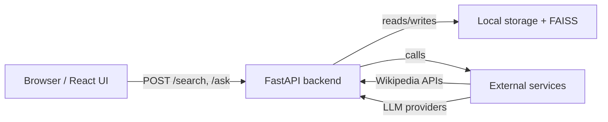
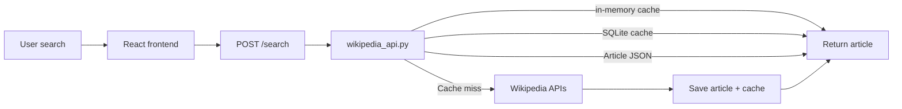
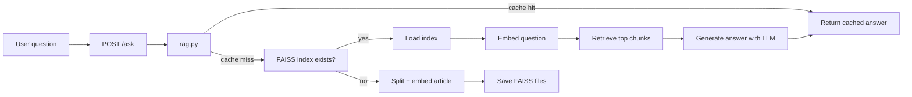

# 🏗️ Architecture Overview

This document describes the AI Wikipedia RAG system in a concise, architecture-first way.

---

## What the system does

- The React frontend sends search and question requests to the FastAPI backend.
- The backend fetches and caches Wikipedia content.
- It retrieves relevant chunks using FAISS embeddings.
- An LLM generates answers from retrieved context only.

---

## High-Level Architecture

### Core layers

- Presentation: `frontend/src/App.jsx`
- API: `backend/app/main.py`
- Retrieval: `backend/app/wikipedia_api.py`, `backend/app/rag.py`
- Embedding: `backend/app/embeddings.py`, `backend/app/vector_store.py`
- LLM: `backend/app/llm.py`
- Storage: `backend/data/` and `backend/data/cache.db`

---

## Core components

| Component | Files | Responsibility |
|---|---|---|
| Frontend | `frontend/src/App.jsx` | UI, search input, ask AI flow |
| API | `backend/app/main.py` | HTTP routing, CORS, request validation |
| Wikipedia fetch | `backend/app/wikipedia_api.py` | title resolution, cache lookup, article fetch |
| RAG orchestration | `backend/app/rag.py` | chunking, retrieval, answer orchestration |
| Embeddings | `backend/app/embeddings.py` | load and run `all-MiniLM-L6-v2` |
| Vector DB | `backend/app/vector_store.py` | FAISS index build/load/search |
| LLM client | `backend/app/llm.py` | choose provider, generate answer |
| Cache | `backend/app/cache.py` | SQLite persistence |
| Article store | `backend/app/article_store.py` | JSON persistence |

---

## Search flow

### Behavior

- `search_wikipedia()` checks cache in this order:
  1. in-memory map
  2. SQLite query cache
  3. local JSON article store
  4. Wikipedia APIs
- Result is returned as title, summary, full content, URL, image.

---

## Question flow

### Behavior

- The backend uses a single article title as the FAISS index key.
- If the index exists, it reuses embeddings and avoids rebuilding.
- The LLM is given only the retrieved chunks and the question.
- Answers are cached in SQLite for later reuse.

---

## Cache architecture

The backend uses multiple local caches:

- `backend/data/cache.db` — SQLite key-value store for search and answer cache.
- `backend/data/articles/*.json` — fetched Wikipedia articles.
- `backend/data/faiss/*.index` and `*.chunks.json` — stored embeddings and text chunks.
- `_query_title_map` — in-memory mapping for repeated queries during one server run.

This improves speed and reduces repeated external fetches.

---

## LLM provider architecture

The LLM layer is primary/fallback to keep the system resilient.

- Primary: `GROQ_API_KEY` → Groq LLM
- Fallback: `OPENROUTER_API_KEY` → OpenRouter

If no key is configured, the backend returns a clear unavailable message.

This keeps the retrieval logic separate from model availability.

---

## Architecture summary

A React frontend sends requests to FastAPI. The backend fetches Wikipedia data, caches it, builds or loads FAISS embeddings, retrieves relevant chunks, and generates answers through a pluggable LLM layer.

The design emphasizes:
- clear separation of concerns
- cache-first retrieval
- reuse of local embeddings
- vendor-agnostic LLM integration
